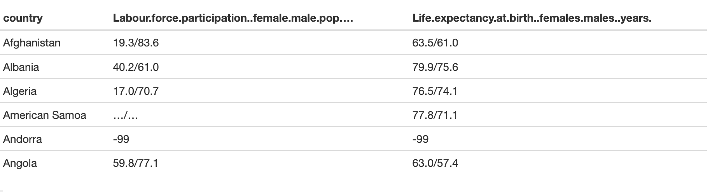
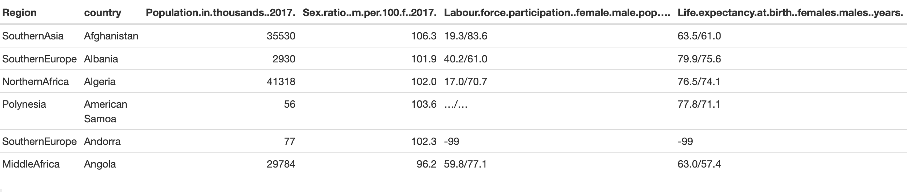
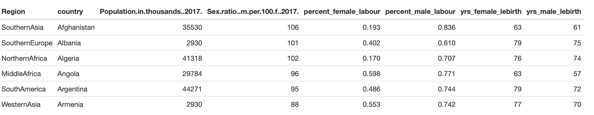
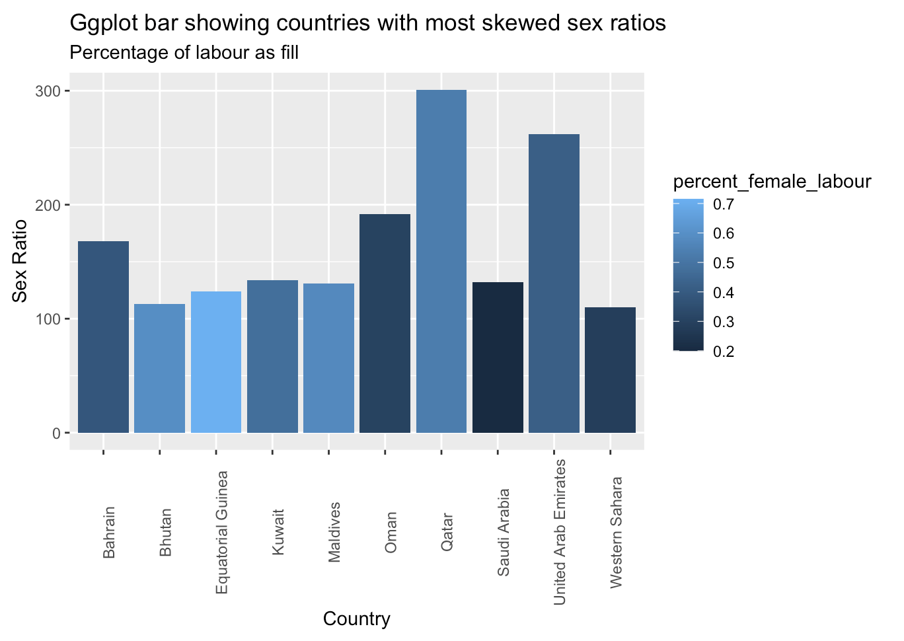
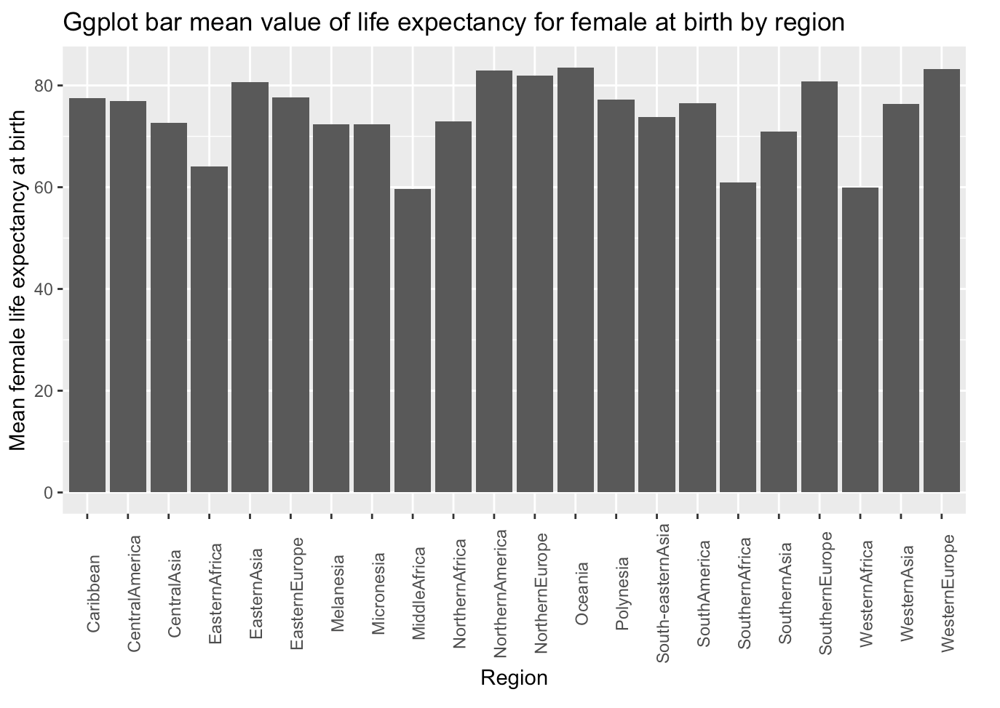
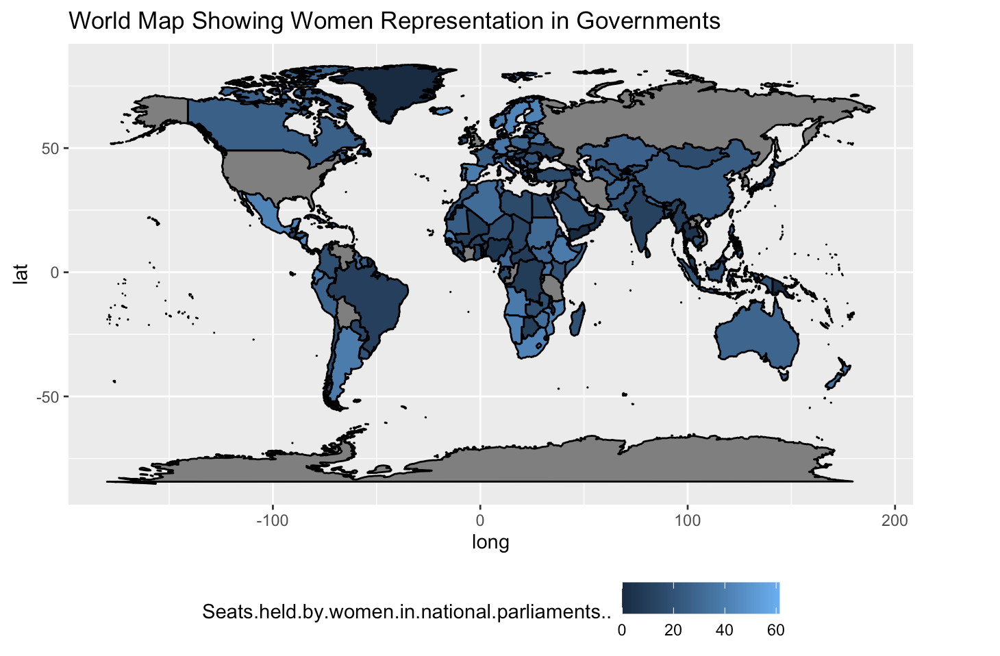

# About Data

### Source:
The data was originally picked up from [UN Data](https://data.un.org) which is an online repository of various datasets generated by the United Nations Organisation and its allied bodies. This was then shared on [Kaggle]( https://www.kaggle.com/sudalairajkumar/undata-country-profiles?select=kiva_country_profile_variables.csv) which is where it was found. 

### Background:
The data presents vast possibilities across 50 features, however to make the most of this data [map_data](https://ggplot2.tidyverse.org/reference/map_data.html) was imported to make use of the country specific data present in the dataset.
  This study aims to take a fresh look into the condition of women in the world, their representation and freedom (to participate in workforce) by use of visual analysis. As part of the homework this dataset was picked due to its *untidy* nature.

### Variables:

The data comprises of a total of 50 variables for this study we will focus on 7 variables and import a few more variables from map_data for map plotting:

- *country* - Specifies country name (such as United States, India, China, etc)
- *Region* - Specifies a group of countries based on its geographical neighbourhood (South America, Carribean, North America, South Asia, etc)
- *Population.in.thousands..2017.* - 2017 Population of the respective country 
- *Sex.ratio..m.per.100.f..2017.* - 2017 Sex ratio of males per 100 females 
- *Labour.force.participation..female.male.pop* - female to male labor population in percentage
- *Life.expectancy.at.birth..females.males..years.* - life expectancy of females to males in years
- *Seats.held.by.women.in.national.parliaments..* - seats held by women in parliaments of respective nations
- *lat* - latitude (from [map_data](https://ggplot2.tidyverse.org/reference/map_data.html))
- *long* - longitude (from [map_data](https://ggplot2.tidyverse.org/reference/map_data.html))

# Objective 1: Show tidy data principle violation

There are three interrelated rules which make a dataset [tidy](https://r4ds.had.co.nz/tidy-data.html#fig:tidy-structure):

- Each variable must have its own column.
- Each observation must have its own row.
- Each value must have its own cell.

In this dataset from the United Nations available at [Kaggle]( https://www.kaggle.com/sudalairajkumar/undata-country-profiles?select=kiva_country_profile_variables.csv), we will study only the columns that violate one of the aforementioned principles. 

> As clearly visible for both columns depicting labour force participation and life expectancy at birth, an attempt has been made to preserve more information within each column. This violates one of the tidy data principles that suggests provision of seperate cell for each value.

> Similarly, let us first seperate out more information from life expectancy column and make sure we omit the NA resulting thereof.

# Objective 2: Data visualization using ggplot

After tidy-ing the data, let us visualize the clean and tidy data.

> This graph shows the top 10 nations with the most skewed sex ratios. As visible these were specially outstanding incase of Qatar, UAE and Oman. It is also clear from this graph that women participation in labour force for countries with skewed sex ratios suffers.

> This graph is based off on a calculated mean of life expectancy at birth for a female in the regions plotted. It gives an idea about patterns seen in certain parts of the world.

> A glace at a global level based on data available for women representation in governments. This gives an idea about the acceptance of women in position of power in the respective societies.
